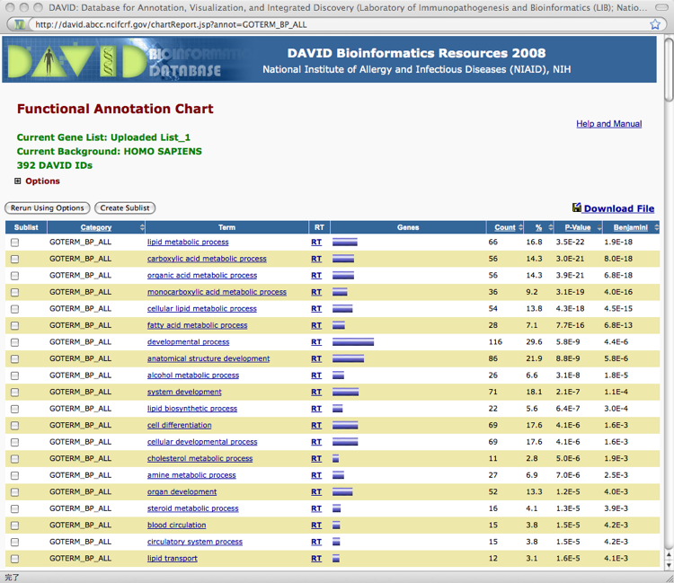

# 統合データベース講習会: AJACS柏オンライン

目次

<ul class="list1" style="padding-left:16px;margin-left:16px"><li><a href="#s6f09f12">  統合データベース講習会: AJACS柏オンライン </a></li>
<li><a href="#taf036b7"> 遺伝子発現データベースに関する統合TV </a></li>
<li><a href="#t5ad14b0"> BioGPS </a>
<ul class="list2" style="padding-left:16px;margin-left:16px"><li><a href="#k6b911bc"> 【実習】BioGPSを使ってある遺伝子の発現プロファイルを調べる </a></li></ul></li>
<li><a href="#r6287e42"> NCBI Gene Expression Omnibus (GEO) </a>
<ul class="list2" style="padding-left:16px;margin-left:16px"><li><a href="#a83d5bfe"> 【実習】GEOを使って、自分の興味のある遺伝子の（ある実験条件下における）発現状況を調べる </a></li>
<li><a href="#mcb0ec77"> 【実習】データセットブラウザ(Dataset browser)を利用して、GEOに登録されているマイクロアレイデータを解析する </a></li>
<li><a href="#ze44dc22"> 【実習】GEOを使って、自分の興味のあるマイクロアレイ実験データセットを検索&amp;生データをダウンロードする </a></li>
<li><a href="#rdfd50d4"> 【参考】遺伝子発現バンク(GEO)目次、通称「GEO目次」 </a></li></ul></li>
<li><a href="#w21fbbe9"> Mouse Genome Informatics(MGI) </a>
<ul class="list2" style="padding-left:16px;margin-left:16px"><li><a href="#p2cbd880"> 【実習】MGIを使ってある遺伝子の様々な実験条件で得られた発現データを閲覧する </a></li>
<li><a href="#e813b839"> 【参考】MGIでノックアウトマウス情報の有無を調べる </a></li></ul></li>
<li><a href="#zef09660"> DAVID: The Database for Annotation, Visualization and Integrated Discovery </a>
<ul class="list2" style="padding-left:16px;margin-left:16px"><li><a href="#y04a402a"> 【実習】DAVIDを用いて、発現データの結果を生物学的に解釈する </a></li>
<li><a href="#od6d0761"> 【実習】Reactomeを使ってマイクロアレイデータの結果の解釈をする </a></li></ul></li>
<li><a href="#w24271f5"> 次世代シーケンサのデータについて </a>
<ul class="list2" style="padding-left:16px;margin-left:16px"><li><a href="#k2ec1368"> 【実習】どのような形でデータが登録されているか見てみよう → 例 </a></li></ul></li></ul>

<a href="#navigator">&uarr;</a>
<h3 id="content_1_1"><a id="taf036b7" href="http://MotDB.DBCLS.jp/?AJACS14.7#taf036b7" title="taf036b7">_</a> 遺伝子発現データベースに関する統合TV  </h3>
<ul class="list1" style="padding-left:16px;margin-left:16px"><li><a href="http://togotv.dbcls.jp/?category=%C8%AF%B8%BD%BE%F0%CA%F3" rel="nofollow">統合TVの「発現情報」タグをクリック！ </a></li></ul>

&nbsp;

&nbsp;

&nbsp;

## 遺伝子発現データベースを使い倒す　　担当：小野浩雅

<a href="#navigator">&uarr;</a>
<h3 id="content_1_2"><a id="t5ad14b0" href="http://MotDB.DBCLS.jp/?AJACS14.7#t5ad14b0" title="t5ad14b0">_</a> <a href="https://biogps.gnf.org/" rel="nofollow">BioGPS</a>  </h3>

ヒト、マウス、ラットのさまざまな組織や細胞(株)における遺伝子発現プロファイルのデータベース

<ul class="list1" style="padding-left:16px;margin-left:16px"><li><a href="https://biogps.gnf.org/" rel="nofollow">BioGPS</a>はAffymetrix社製のマイクロアレイであるGeneChip<a href="http://MotDB.DBCLS.jp/?cmd=edit&amp;page=GeneChip&amp;refer=AJACS14.7">?</a>を用いた遺伝子発現プロファイルのデータベース。</li>
<li><a href="http://symatlas.gnf.org/" rel="nofollow">GNF SymAtlas</a><a href="http://togotv.dbcls.jp/20070816.html" rel="nofollow">【参考動画】</a>のメジャーアップデート版。</li>
<li>マウスのエキソンアレイのデータが追加されたので、遺伝子のスプライシングバリアント(Splicing variant)の発現状況も調べることが可能。</li>
<li>検索した遺伝子に対して、種々の外部データベースに横断検索することができる。</li></ul>

<a href="#navigator">&uarr;</a>
<h3 id="content_1_3"><a id="k6b911bc" href="http://MotDB.DBCLS.jp/?AJACS14.7#k6b911bc" title="k6b911bc">_</a> 【実習】BioGPSを使ってある遺伝子の発現プロファイルを調べる  </h3>
<ul class="list1" style="padding-left:16px;margin-left:16px"><li><a href="http://togotv.dbcls.jp/20081004.html#p01" rel="nofollow">【使い方参考動画】</a>、<a href="http://togotv.dbcls.jp/20090217.html#p01" rel="nofollow">【講習会動画】</a></li>
<li>1. <a href="https://biogps.gnf.org/" rel="nofollow">https://biogps.gnf.org/</a>を開きます。</li>
<li>2.骨格筋の分化決定遺伝子であるMyogenic differentiation 1(MyoD)の発現プロファイルを調べてみましょう。中央の検索窓に「myod」と入力し、「search」を押します。</li>
<li>3. 表示された検索結果をクリックします。</li>
<li>4. 最初はヒトのマイクロアレイデータが表示されます。</li>
<li>5. マイクロアレイデータ左上の「Human(4654)」をクリックするとマウスやラットを選択できるので、「Mouse(17927)」をクリックしてマウスのデータを表示できます。</li>
<li>6. MyoDはどの組織、細胞で強く発現しているでしょうか？</li>
<li>7. 右上の「default rayout」をクリックすると、検索した遺伝子に関するマイクロアレイデータ以外のデータが閲覧できますが、どのようなデータが閲覧できるのか調べてみましょう。</li>
<li>8. 左上の「Search」タグをクリックして検索画面にもどり、自分の興味ある遺伝子について同様に検索してみましょう。</li></ul>

<a href="#navigator">&uarr;</a>
<h3 id="content_1_4"><a id="r6287e42" href="http://MotDB.DBCLS.jp/?AJACS14.7#r6287e42" title="r6287e42">_</a> <a href="http://www.ncbi.nlm.nih.gov/geo/" rel="nofollow">NCBI Gene Expression Omnibus (GEO)</a>  </h3>

世界最大の遺伝子発現（<a href="http://ja.wikipedia.org/wiki/DNA%E3%83%9E%E3%82%A4%E3%82%AF%E3%83%AD%E3%82%A2%E3%83%AC%E3%82%A4" rel="nofollow">マイクロアレイ</a>）データベース（レポジトリ）

<a href="#navigator">&uarr;</a>
<h3 id="content_1_5"><a id="a83d5bfe" href="http://MotDB.DBCLS.jp/?AJACS14.7#a83d5bfe" title="a83d5bfe">_</a> 【実習】GEOを使って、自分の興味のある遺伝子の（ある実験条件下における）発現状況を調べる  </h3>
<ul class="list1" style="padding-left:16px;margin-left:16px"><li><a href="http://togotv.dbcls.jp/20090213.html#p01" rel="nofollow">【使い方参考動画】</a></li>
<li>1. <a href="http://www.ncbi.nlm.nih.gov/geo/" rel="nofollow">http://www.ncbi.nlm.nih.gov/geo/</a>を開きます。</li>
<li>2.「Gene profiles」に自分の検索したい遺伝子名を入力します。</li>
<li>3. 今回は例として「<a href="http://www.google.co.jp/search?hl=ja&amp;q=Nanog%E9%81%BA%E4%BC%9D%E5%AD%90" rel="nofollow">nanog</a>」という遺伝子を検索してみましょう。入力終了後、「GO」をクリックします。</li>
<li>4. GEOに登録されている様々な実験条件で行なわれたマイクロアレイ実験における「nanog」遺伝子の発現データが表示されます。</li>
<li>5. 検索結果の右端にある画像をクリックすると、<a href="http://www.ncbi.nlm.nih.gov/geo/gds/profileGraph.cgi?&amp;dataset=DEAryz&amp;dataset=yyyzzz$&amp;gmin=5173.000000&amp;gmax=11680.000000&amp;absc=&amp;gds=2294&amp;idref=161072_at&amp;annot=Nanog" rel="nofollow">発現データの詳細をみる</a>ことができます。</li>
<li>6. 「Display values」をクリックすると、発現値を一覧できます。</li>
<li>7. <a href="http://www.ncbi.nlm.nih.gov/sites/GDSbrowser?acc=GDS2294" rel="nofollow">このサンプル</a>では、nanogはどういう細胞のどういう実験条件で発現が増減しているか調べてみましょう。</li>
<li>8. ページ下部の「samples」に列挙された<a href="http://www.ncbi.nlm.nih.gov/geo/query/acc.cgi?acc=GSM130365" rel="nofollow">リンク</a>をクリックすると、そのサンプル（一枚のマイクロアレイ）の詳細を閲覧できます。</li>
<li>9. <a href="http://www.ncbi.nlm.nih.gov/geo/query/acc.cgi?acc=GSM130365" rel="nofollow">リンク先のページ</a>の中ほどにある<a href="http://www.ncbi.nlm.nih.gov/geo/query/acc.cgi?acc=GSE5583" rel="nofollow">「series」のリンク</a>をクリックすると、この実験全体の詳細情報が見られます。</li>
<li>10. <a href="http://www.ncbi.nlm.nih.gov/geo/query/acc.cgi?acc=GSE5583" rel="nofollow">この実験全体の詳細情報ページ</a>の下部にある<a href="ftp://ftp.ncbi.nih.gov/pub/geo/DATA/SeriesMatrix/GSE5583/" rel="nofollow">「Series Matrix File(s)」</a>をクリックすると、この実験の正規化補正済みのマイクロアレイデータをダウンロードすることができます。</li></ul>

<a href="#navigator">&uarr;</a>
<h3 id="content_1_6"><a id="mcb0ec77" href="http://MotDB.DBCLS.jp/?AJACS14.7#mcb0ec77" title="mcb0ec77">_</a> 【実習】データセットブラウザ(Dataset browser)を利用して、GEOに登録されているマイクロアレイデータを解析する  </h3>
<ul class="list1" style="padding-left:16px;margin-left:16px"><li><a href="http://togotv.dbcls.jp/20090221.html#p01" rel="nofollow">【使い方参考動画1】</a> 、<a href="http://togotv.dbcls.jp/20090307.html#p01" rel="nofollow">【使い方参考動画2】</a></li>
<li>1. <a href="http://www.ncbi.nlm.nih.gov/geo/" rel="nofollow">http://www.ncbi.nlm.nih.gov/geo/</a>を開きます。</li>
<li>2.「Gene profiles」に自分の検索したい遺伝子名を入力します。</li>
<li>3. 今回は例として「<a href="http://www.google.co.jp/search?hl=ja&amp;q=Nanog%E9%81%BA%E4%BC%9D%E5%AD%90" rel="nofollow">nanog</a>」という遺伝子を検索してみましょう。入力終了後、「GO」をクリックします。</li>
<li>4. GEOに登録されている様々な実験条件で行なわれたマイクロアレイ実験における「nanog」遺伝子の発現データが表示されます。</li>
<li>5. 検索結果の<a href="http://www.ncbi.nlm.nih.gov/sites/GDSbrowser?acc=GDS2294" rel="nofollow">アクセッション番号（今回は GDS2294）</a>をクリックすると、解析用の「データセットブラウザ」が開きます。</li>
<li>6. 「Expression profiles」をクリックすると、<a href="http://MotDB.DBCLS.jp/?%5B%5Bhttp%3A%2F%2Fwww.ncbi.nlm.nih.gov%2Fsites%2Fentrez%3Fdb%3Dgeo%26cmd%3Dsearch%26term%3DGDS2294%5BACCN%5D%5D" title="http://www.ncbi.nlm.nih.gov/sites/entrez?db=geo&amp;cmd=search&amp;term=GDS2294[ACCN" rel="nofollow">この実験データセットにおける個々の遺伝子発現状況を検索できるページ</a>に飛びます。</li>
<li>7. 検索窓に表示されているアクセッション番号の後に続けて遺伝子名を追加（今回は例として <a href="http://www.google.co.jp/search?q=Oct4" rel="nofollow">Oct4</a> ）すると、この実験データセット内におけるその遺伝子の発現データが検索できます。</li>
<li>8. 「データセットブラウザ」の「Data Analysis Tools」では詳細なデータ解析が可能です。</li>
<li>9. 「Find gene name or symbol:」のところに自分の興味ある遺伝子名を入れてみましょう。</li>
<li>10. 「Find genes that are up/down for this condition(s):」の「GO」をクリックするとどのような遺伝子がヒットするでしょうか。</li>
<li>11. 「Compare 2 sets of samples」では2群間で発現に差のある遺伝子を（統計学的に）検索できます。step1で発現量の違いを検出する方法を設定します。step.2で比較する2群の設定をします。step.3の「Query Group A vs. B」をクリックすると、検索が始まります。</li>
<li>12. 「Cluster heatmaps」では、マイクロアレイデータ解析でよく用いられる<a href="http://MotDB.DBCLS.jp/?%5B%5Bhttp%3A%2F%2Fimages.google.co.jp%2Fimages%3Fq%3D%A5%D2%A1%BC%A5%C8%A5%DE%A5%C3%A5%D7%5D%5D" title="http://images.google.co.jp/images?q=ヒートマップ" rel="nofollow">ヒートマップ</a>でのデータ表示が行なえます。分類方法としてHierarchical、Partitional (K-means/K-medians)、By location on chromosomeの3種類が選べますが、それぞれどのようにデータが分類されるか試してみましょう。</li>
<li>13.  「Experiment design and value distribution」では実験データにおける発現の分布を参照できます。これにより、各サンプルのデータが互いに比較可能か（実験上のミスがないか）チェックすることができます。</li></ul>

<a href="#navigator">&uarr;</a>
<h3 id="content_1_7"><a id="ze44dc22" href="http://MotDB.DBCLS.jp/?AJACS14.7#ze44dc22" title="ze44dc22">_</a> 【実習】GEOを使って、自分の興味のあるマイクロアレイ実験データセットを検索&amp;生データをダウンロードする  </h3>
<ul class="list1" style="padding-left:16px;margin-left:16px"><li><a href="http://togotv.dbcls.jp/20081218.html#p01" rel="nofollow">【使い方参考動画】</a></li>
<li>1. <a href="http://www.ncbi.nlm.nih.gov/geo/" rel="nofollow">http://www.ncbi.nlm.nih.gov/geo/</a>を開きます。</li>
<li>2. 画面中央の「Platforms」をクリックします。</li>
<li>3. <a href="http://www.informatics.jax.org/javawi2/servlet/WIFetch?page=imageSummaryByMrk&amp;key=25000&amp;imageType=8" rel="nofollow">Platform(マイクロアレイの種類)の一覧画面が現れる</a>ので、上部の「FIND PLATFORM」をクリックします。</li>
<li>4. <a href="http://www.ncbi.nlm.nih.gov/geo/query/browse.cgi?mode=findplatform" rel="nofollow">platformの検索画面</a>が現れるので、「Company name」に「Affymetrix」、「organism」に「Homo sapiens」を選択し、「FIND PLATFORM」をクリックします。</li>
<li>5. <a href="http://www.ncbi.nlm.nih.gov/geo/query/browse.cgi?mode=foundplatform" rel="nofollow">Affymetrixのヒトのマイクロアレイの検索結果</a>が表示されるので、中程にある「Affymetrix GeneChip<a href="http://MotDB.DBCLS.jp/?cmd=edit&amp;page=GeneChip&amp;refer=AJACS14.7">?</a> Human Genome U133 Plus 2.0 Array」の左端にある<a href="http://www.ncbi.nlm.nih.gov/geo/query/acc.cgi?acc=GPL570" rel="nofollow">「GPL570」というID</a>をクリックします。</li>
<li>6. <a href="http://www.ncbi.nlm.nih.gov/geo/query/acc.cgi?acc=GPL570" rel="nofollow">表示された画面</a>の真ん中あたりにある「series」下の「More...」をクリックすると、登録されているデータセットを閲覧できます。</li>
<li>7. ブラウザの検索ボタンなどを使って「reprogramming」という単語を検索するとどういうデータがヒットするでしょうか？</li>
<li>8. ヒットしたデータの左端にあるIDをクリックすると、<a href="http://www.ncbi.nlm.nih.gov/geo/query/acc.cgi?acc=GSE9832" rel="nofollow">そのデータセットの詳細情報</a>が閲覧できます</li>
<li>9. ページ下部の「Download family」の中にある「Series Matrix File(s)」をクリックすると正規化済みのデータのダウンロードリンクが表示されます。</li>
<li>10. ページ最下部の「Supplementary file」にあるリンクから生データをダウンロードすることができます。</li>
<li>11. 自分の研究テーマに近い、また興味のあるマイクロアレイデータが利用可能か検索してみましょう。</li></ul>

<a href="#navigator">&uarr;</a>
<h3 id="content_1_8"><a id="rdfd50d4" href="http://MotDB.DBCLS.jp/?AJACS14.7#rdfd50d4" title="rdfd50d4">_</a> 【参考】<a href="http://lifesciencedb.jp/geo/" rel="nofollow">遺伝子発現バンク(GEO)目次、通称「GEO目次」</a>  </h3>
<ul class="list1" style="padding-left:16px;margin-left:16px"><li><a href="http://togotv.dbcls.jp/20080623.html#p01" rel="nofollow">使い方参考動画</a> </li>
<li>NCBI GEO を日本語のインターフェイスで快適に使い、データの全容を俯瞰するための仕組み</li>
<li>今後さらに使いやすくアップデート予定</li></ul>

<a href="#navigator">&uarr;</a>
<h3 id="content_1_9"><a id="w21fbbe9" href="http://MotDB.DBCLS.jp/?AJACS14.7#w21fbbe9" title="w21fbbe9">_</a> <a href="http://www.informatics.jax.org/" rel="nofollow">Mouse Genome Informatics(MGI)</a>  </h3>

マウスに関する遺伝子、ゲノム、生物学的な情報を提供する統合データベース

<a href="#navigator">&uarr;</a>
<h3 id="content_1_10"><a id="p2cbd880" href="http://MotDB.DBCLS.jp/?AJACS14.7#p2cbd880" title="p2cbd880">_</a> 【実習】MGIを使ってある遺伝子の様々な実験条件で得られた発現データを閲覧する  </h3>
<ul class="list1" style="padding-left:16px;margin-left:16px"><li><a href="http://togotv.dbcls.jp/20081205.html#p01" rel="nofollow">【使い方参考動画】</a>、<a href="http://togotv.dbcls.jp/20090217.html#p01" rel="nofollow">【講習会動画】</a></li>
<li>1.  <a href="http://www.informatics.jax.org/" rel="nofollow">http://www.informatics.jax.org/</a>を開きます。</li>
<li>2. 脂肪代謝関連遺伝子であるperoxisome proliferator-activated receptor (PPAR) alphaのデータを調べてみましょう。サイト上部の検索窓に「ppara」と入力し、「Quick Search」を押します。</li>
<li>3. <a href="http://www.informatics.jax.org/searchtool/Search.do?query=ppara&amp;submit=Quick+Search" rel="nofollow">検索結果が表示</a>されるので「Genome Features」の項にある「ppara」をクリックします。</li>
<li>4. <a href="http://www.informatics.jax.org/javawi2/servlet/WIFetch?page=markerDetail&amp;key=25000" rel="nofollow">「Gene Detail」</a>が表示されます。真ん中あたりの「Expression」の項目へ移動します。</li>
<li>5. 「Data Summary」の <a href="http://www.informatics.jax.org/searches/expression_report.cgi?_Marker_key=25000&amp;returnType=assays&amp;sort=Assay%20type" rel="nofollow">Assays（実験手法別）</a>、<a href="http://www.informatics.jax.org/searches/expression_report.cgi?_Marker_key=25000&amp;returnType=assay%20results&amp;sort=Anatomical%20structure" rel="nofollow">Results（全結果）</a>、<a href="http://www.informatics.jax.org/javawi2/servlet/WIFetch?page=markerTissues&amp;key=25000" rel="nofollow">Tissues（組織別）</a>、<a href="http://www.informatics.jax.org/javawi2/servlet/WIFetch?page=imageSummaryByMrk&amp;key=25000&amp;imageType=8" rel="nofollow">Images（Figのある結果）</a>のそれぞれから発現データを一覧することができます。</li>
<li>6. 自分の興味ある遺伝子について同様に検索してみましょう。</li></ul>

<a href="#navigator">&uarr;</a>
<h3 id="content_1_11"><a id="e813b839" href="http://MotDB.DBCLS.jp/?AJACS14.7#e813b839" title="e813b839">_</a> 【参考】MGIでノックアウトマウス情報の有無を調べる  </h3>

<a href="http://togotv.dbcls.jp/20081128.html#p01" rel="nofollow">統合TVで紹介していますので興味ある方はぜひご覧ください。</a>

&nbsp;

&nbsp;

&nbsp;

## 遺伝子発現データの生物学的な解釈　　　　担当：仲里猛留

<a href="#navigator">&uarr;</a>
<h3 id="content_1_12"><a id="zef09660" href="http://MotDB.DBCLS.jp/?AJACS14.7#zef09660" title="zef09660">_</a> <a href="http://david.abcc.ncifcrf.gov/" rel="nofollow">DAVID: The Database for Annotation, Visualization and Integrated Discovery</a>  </h3>

マイクロアレイデータの生物学的な解釈

<ul class="list1" style="padding-left:16px;margin-left:16px"><li>上で述べたマイクロアレイの結果の解析は、統計解析で、それらの遺伝子が生物学的にどういう意味を持つかわかりません。</li>
<li>そこで、Gene Ontologyの用語を付与することで、生物学的な解釈を行います。</li>
<li>【参考動画】<a href="http://togotv.dbcls.jp/20090925.html#p01" rel="nofollow">DAVIDを使ってマイクロアレイデータを解析する</a></li></ul>

<a href="#navigator">&uarr;</a>
<h3 id="content_1_13"><a id="y04a402a" href="http://MotDB.DBCLS.jp/?AJACS14.7#y04a402a" title="y04a402a">_</a> 【実習】DAVIDを用いて、発現データの結果を生物学的に解釈する  </h3>
<ul class="list1" style="padding-left:16px;margin-left:16px"><li>1. 上部メニューの「Start Analysis」をクリック</li>
<li>2. 画面左側バーで、probe IDリストをコピペ or ファイルを指定
<ul class="list2" style="padding-left:16px;margin-left:16px"><li>今回は、統合TVと同じ、NCBI GEOより取得した公共の遺伝子発現データ（GSE1657:Adipocyte Differentiation [Homo sapiens]）を用いて、ヒトの脂肪細胞の分化過程で発現増加した<a href="090907_sample_U133A_adipo.txt" rel="nofollow">上位500個の遺伝子群のリスト</a>を使って説明しています。</li></ul></li>
<li>3. リストのIDの種類タイプを選択 … 今回は、「AFFY_ID」と「Gene List」</li>
<li>4. Submit List をクリック → 読み込まれる</li>
<li>5. 今、アップロードしたリストは、左側バーの「List Manager」で「Uploaded List_1」として保存されています。削除やrenameもできます。</li>
<li>6. 解析を続けます。真ん中の「Functional Annotation Tool」をクリック</li>
<li>7. 今回は、Gene Ontologyでの解析を行います。「Gene Ontology」をクリック → Gene Ontologyでの解析の細かいメニューが表示されます</li>
<li>8. 今回は、GOTERM_BP_ALL (BP=Biological Process)に注目します。その右の「Chart」をクリック → 結果がポップアップします</li>
<li>9. P-value を2回クリックしてp-valueが小さい（統計的に有意である）順にしてみましょう … p-value小さい順は、一度やればしばらく覚えているので、次からはしばらくは必要ないです

結果

</li>
<li>[応用編] Pathways &gt; KEGG_PATHWAY や Tissue Expression &gt; UP_TISSUE なども見てみよう。生物学的にどういうことが言えるだろうか。</li>
<li>参考：<a href="http://www.animalgenome.org/bioinfo/tools/countgo/" rel="nofollow">GO Terms Classification Counter (CateGOrizer)</a>というのもあります。詳しくは、<a href="http://motdb.dbcls.jp/?AJACS12%2Fhono3" rel="nofollow">こちら</a></li></ul>

<a href="#navigator">&uarr;</a>
<h3 id="content_1_14"><a id="od6d0761" href="http://MotDB.DBCLS.jp/?AJACS14.7#od6d0761" title="od6d0761">_</a> 【実習】Reactomeを使ってマイクロアレイデータの結果の解釈をする  </h3>
<ul class="list1" style="padding-left:16px;margin-left:16px"><li><a href="http://togotv.dbcls.jp/20090508.html#p01" rel="nofollow">【使い方参考動画】</a></li>
<li>1. <a href="http://www.reactome.org/" rel="nofollow">http://www.reactome.org/</a>を開きます。</li>
<li>2.上部の「Tools」から「SkyPainter<a href="http://MotDB.DBCLS.jp/?cmd=edit&amp;page=SkyPainter&amp;refer=AJACS14.7">?</a>」をクリックします。</li>
<li>3. 「参照」をクリックして、<a href="090907_sample_U133A_adipo.txt" title="2009/12/07 17:19:13 5.9KB">090907_sample_U133A_adipo.txt</a>をアップロードします。</li>
<li>4.「Focus species」を「Homo Sapiens」に設定します。</li>
<li>5.「Paint!」をクリックします。</li>
<li>6.結果が表示されます。</li>
<li>7.DAVIDやGO Terms Classification Counter (CateGOrizer)で出力された結果とどこがどう違うか考えてみましょう。</li></ul>

<a href="#navigator">&uarr;</a>
<h3 id="content_1_15"><a id="w24271f5" href="http://MotDB.DBCLS.jp/?AJACS14.7#w24271f5" title="w24271f5">_</a> 次世代シーケンサのデータについて  </h3>
<ul class="list1" style="padding-left:16px;margin-left:16px"><li>次世代シーケンサのデータは、中身は配列データですが、ある状態での遺伝子発現を塩基配列として検出することもでき、遺伝子発現データとしてもとらえられます
<ul class="list2" style="padding-left:16px;margin-left:16px"><li>ゲノム解読として使う場合は、配列データとしてで、発現データを得るためにも用いることができる、ということです。</li></ul></li>
<li>次世代シーケンサによる測定結果（≠解析結果）も、登録、公開のしくみができている
<ul class="list2" style="padding-left:16px;margin-left:16px"><li>NCBI：Short Read Archive (SRA) <a href="http://www.ncbi.nlm.nih.gov/Traces/sra/sra.cgi" rel="nofollow">http://www.ncbi.nlm.nih.gov/Traces/sra/sra.cgi</a></li>
<li>EBI：European Read Archive (ERA)
<a href="http://www.ebi.ac.uk/embl/Documentation/ENA-Reads.html" rel="nofollow">http://www.ebi.ac.uk/embl/Documentation/ENA-Reads.html</a></li>
<li>DDBJ：DDBJ Read Archive (DRA) <a href="http://trace.ddbj.nig.ac.jp/dra/index.shtml" rel="nofollow">http://trace.ddbj.nig.ac.jp/dra/index.shtml</a></li></ul></li></ul>

<a href="#navigator">&uarr;</a>
<h3 id="content_1_16"><a id="k2ec1368" href="http://MotDB.DBCLS.jp/?AJACS14.7#k2ec1368" title="k2ec1368">_</a> 【実習】どのような形でデータが登録されているか見てみよう → <a href="http://tinyurl.com/lzlles" rel="nofollow">例</a>  </h3>
<ul class="list2" style="padding-left:32px;margin-left:32px"><li>参考：<a href="http://trace.ddbj.nig.ac.jp/dra/documentation.shtml" rel="nofollow">DRA Documentation</a></li></ul>
